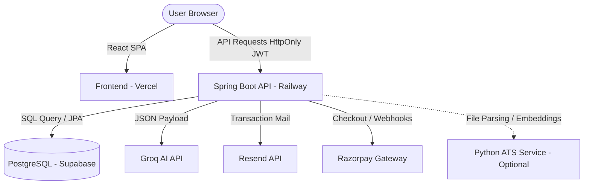

# CareerDraft AI — Intelligent Resume Builder & ATS Analyzer

[](https://openjdk.org/)
[](https://spring.io/projects/spring-boot)
[](https://react.dev/)
[](https://opensource.org/licenses/MIT)
[](https://career-draft-ai.vercel.app)

An intelligent SaaS platform that empowers job seekers to build, tailor, and analyze resumes using AI. Leveraging **Spring Boot** and **React with Tailwind CSS**, CareerDraft AI extracts resume text, scores relevance using an advanced 6-dimensional ATS matching engine (with a native Java rule-based fallback), and generates quantified professional enhancements via the **Groq AI API**.

---

## 🚀 Live Demo

**👉 Visit the Deployed Application:** [https://career-draft-ai.vercel.app/](https://career-draft-ai.vercel.app/)

> [!NOTE]
> **Backend Cold Starts**: The backend is hosted on a free tier on Railway. If the application has been inactive, the first request (e.g., logging in or analyzing a resume) may experience a cold start delay of **30–60 seconds** while the container spins up. Subsequent requests will be near-instantaneous.

---

## 📷 Screenshots


*Detailed 6-dimensional ATS scoring, keyword gap analysis, and contextual tailoring tips.*


*Pro user dashboard showing history, version rollbacks, and payment settings.*

> Add your own screenshots to a `screenshots/` folder in the repo root using the filenames above (`landing.png`, `ats-analysis.png`, `dashboard.png`), or update the paths here to match whatever you name them.

---

## ✨ Features

*   **AI-Powered Resume Generation & Enhancement**: Auto-generates structured resumes from a simple natural language description and refines individual bullet points (using strong action verbs and quantified achievements) powered by the **Groq API**.
*   **6-Dimensional ATS Scoring**: Scores compatibility across Critical Skills, Core Skills, Experience, Formatting, Keywords, and Education. Features a Python-based NLP service using semantic embeddings, and automatically degrades to a **Java-native rule-based fallback engine** when the Python service is offline.
*   **Secure Authentication**: Secure sign-up/login flow with email OTP verification (sent via Resend) and secure SHA-256 hashed token password reset. Session tokens are stored in **HttpOnly, SameSite cookies** to defend against XSS and CSRF.
*   **Pro Upgrades (Razorpay Integration)**: Dynamic payment processing for Pro tiers using a secure Razorpay checkout flow, verified via both **synchronous callback verification** and **asynchronous Webhooks** with cryptographic signature validation.
*   **Admin Dashboard**: Restricted operations center supporting real-time user management (enabling/disabling users, manual Pro grants/revocations), revenue overview, payment history logs, and system metrics.
*   **Resume Templates & Customization**: Multiple modern ATS-compliant styling layouts, custom color themes, font selections, and version tracking (Pro users can roll back to any previous version in history).

---

## 🛠️ Tech Stack

### Backend
*   **Framework**: Spring Boot 3.4.3 (Java 21)
*   **Security**: Spring Security, JJWT (JSON Web Tokens 0.12.3)
*   **Utilities**: Apache PDFBox (2.0.29) & POI (5.2.5) for PDF/DOCX text extraction, Bucket4j (8.10.1) for rate limiting, Dotenv Java (3.0.0)

### Frontend
*   **Framework**: React 18.3.1 (Vite 6.0.5)
*   **Styling**: Tailwind CSS 3.4.17 + DaisyUI 4.12.23
*   **State & Animation**: React Context API, React Hook Form (7.54.2), Framer Motion (12.42.2)

### Database & Third-Party Integrations
*   **Database**: PostgreSQL hosted on **Supabase** (with HikariCP connection pooling optimized for Supabase Pooler resiliency)
*   **AI Inference**: **Groq API** (`llama-3.1-8b-instant` model)
*   **Email Dispatch**: **Resend REST API** for transactional OTP and reset notifications
*   **Payments**: **Razorpay Gateway** for checkout and Webhooks

### Deployment
*   **Frontend**: Vercel
*   **Backend**: Railway

---

## 📐 Architecture Overview



CareerDraft AI uses a decoupled architecture. The React single-page frontend handles templates, layouts, and UI state, communicating with a stateless Spring Boot REST API. Session state is carried in a JWT stored inside an HttpOnly cookie.

The ATS scoring service uses a dual-engine design: if the semantic Python service (FastAPI, spaCy, Sentence-Transformers) is offline or not deployed, the Spring Boot backend falls back seamlessly to its deterministic Java rule-based parser — so the core product has no hard runtime dependency on Python.

---

## 🚀 Getting Started (Local Setup)

### Prerequisites
*   **Java**: JDK 21
*   **Node.js**: v18+ (npm v9+)
*   **Maven**: 3.8+ (or use the provided `./mvnw` wrapper)
*   **Database**: A PostgreSQL instance (local or hosted Supabase account)

### Step 1: Clone the Repository
```bash
git clone https://github.com/sachinskill/CareerDraft-AI.git
cd CareerDraft-AI
```

### Step 2: Configure and Start the Backend
1. Navigate to the backend directory:
   ```bash
   cd resume-ai-backend
   ```
2. Copy the environment template and configure your credentials:
   ```bash
   cp .env.example .env
   ```
   Open the `.env` file and populate the properties (see the Environment Variables section below).
3. Start the backend:
   ```bash
   ./mvnw spring-boot:run
   ```
   The backend will run on port `8081` by default.

### Step 3: Configure and Start the Frontend
1. Navigate to the frontend directory:
   ```bash
   cd ../resume_frontend
   ```
2. Copy the environment template:
   ```bash
   cp .env.example .env
   ```
3. Install dependencies and start the development server:
   ```bash
   npm install
   npm run dev
   ```
   The frontend will run on port `5173` by default.

---

## 🔑 Environment Variables

### Backend Configuration (`resume-ai-backend/.env`)

| Variable | Description | Required for Dev |
|---|---|---|
| `SERVER_PORT` | Port for the backend service (Default: `8081`) | Yes |
| `DB_URL` | JDBC database connection string | Yes |
| `DB_USERNAME` | Database username | Yes |
| `DB_PASSWORD` | Database password | Yes |
| `AI_MODE` | Set to `mock` to bypass external AI usage, or `groq` to use the Groq API | Yes |
| `GROQ_API_KEY` | Groq developer API key | Optional (if `AI_MODE=mock`) |
| `GROQ_MODEL` | Groq AI model name (Default: `llama-3.1-8b-instant`) | Yes |
| `JWT_SECRET` | Secure cryptographic secret key (at least 32 characters) | Yes |
| `COOKIE_SECURE` | Set to `true` in production (enables secure flags), `false` in development | Yes |
| `COOKIE_DOMAIN` | Cookie scope domain (Default: `localhost`) | Yes |
| `CORS_ALLOWED_ORIGINS` | Permitted cross-origin endpoints | Yes |
| `FRONTEND_URL` | Base URL of the React frontend app | Yes |
| `ATS_PYTHON_URL` | URL of the optional Python microservice (Default: `http://localhost:8000`) | Optional |
| `RESEND_API_KEY` | Resend mailing service authorization key | Optional (email dispatch is skipped gracefully if omitted) |
| `RESEND_FROM_EMAIL` | Sender address (must be verified in the Resend console) | Optional |
| `RAZORPAY_KEY_ID` | Razorpay developer key ID | Yes — app fails to boot if empty |
| `RAZORPAY_KEY_SECRET` | Razorpay developer key secret | Yes — app fails to boot if empty |

### Frontend Configuration (`resume_frontend/.env`)
*   `VITE_API_URL`: Fully-qualified address of the running Spring Boot API (Default: `http://localhost:8081`).

---

## 🔒 Security Highlights
*   **Stateless Cookie-Based JWT**: Session tokens are stored in HttpOnly cookies with SameSite directives, protecting them from client-side script access.
*   **Cryptographic Password Protection**: User passwords are hashed with BCrypt before database persistence — plaintext passwords are never stored.
*   **Hashed Verification Tokens**: Email verification OTPs and password-reset tokens are SHA-256 hashed before storage, so no plain-text tokens exist in the database.
*   **Role-Based Access Control (RBAC)**: Route-level Spring Security interceptors restrict admin endpoints to users with `ROLE_ADMIN`.

---

## 📋 API Overview

### 🔐 Authentication (`/api/auth`)
*   `POST /api/auth/register` — Registers a new (inactive) user account and triggers email verification.
*   `POST /api/auth/login` — Authenticates credentials, validates active status, and issues an HttpOnly JWT cookie.
*   `POST /api/auth/verify-email` — Confirms the email verification OTP.
*   `POST /api/auth/forgot-password` — Generates and dispatches a password-reset link.

### 📝 Resume Management (`/api/resumes`)
*   `GET /api/resumes` — Retrieves the authenticated user's saved resumes.
*   `POST /api/resumes` — Saves a new resume draft.
*   `PUT /api/resumes/{id}` — Saves revisions and stores historical snapshots (Pro only).
*   `POST /api/resumes/{id}/rollback/{versionId}` — Restores a previous version (Pro only).

### 📊 ATS Analysis (`/api/v1/ats`)
*   `POST /api/v1/ats/upload` — Uploads a PDF/DOCX resume and returns a structured compatibility score.
*   `POST /api/v1/ats/analyze` — Scores a structured JSON resume against a job description.

### 💳 Payments (`/api/payment`)
*   `POST /api/payment/create-order` — Creates a new Razorpay order for a Pro upgrade.
*   `POST /api/payment/verify` — Validates the client-side Razorpay signature and updates the user's tier.
*   `POST /api/payment/webhook` — Processes asynchronous server-to-server Razorpay payment notifications.

---

## 📁 Repository Structure
```
CareerDraft-AI/
├── resume-ai-backend/           # Spring Boot application
│   ├── src/main/java            # Java source files
│   ├── src/main/resources       # Application config & email templates
│   ├── pom.xml                  # Maven dependencies
│   └── Dockerfile               # Backend container configuration
├── resume_frontend/             # React application
│   ├── src/                     # Components & context hooks
│   ├── public/                  # Static assets
│   ├── package.json             # Node dependencies
│   ├── tailwind.config.js       # Styling theme configuration
│   └── vite.config.js           # Build settings
└── ats-python-service/          # Python NLP microservice (optional, not deployed)
```

---

## 📄 License

This project is licensed under the MIT License — see the [LICENSE](LICENSE) file for details.

---

## 👨‍💻 Contact & Author
*   **Author**: Sachin Gupta
*   **GitHub**: [@sachinskill](https://github.com/sachinskill)
*   **LinkedIn**: [Sachin Gupta](https://linkedin.com/in/sachin-legacy/)

